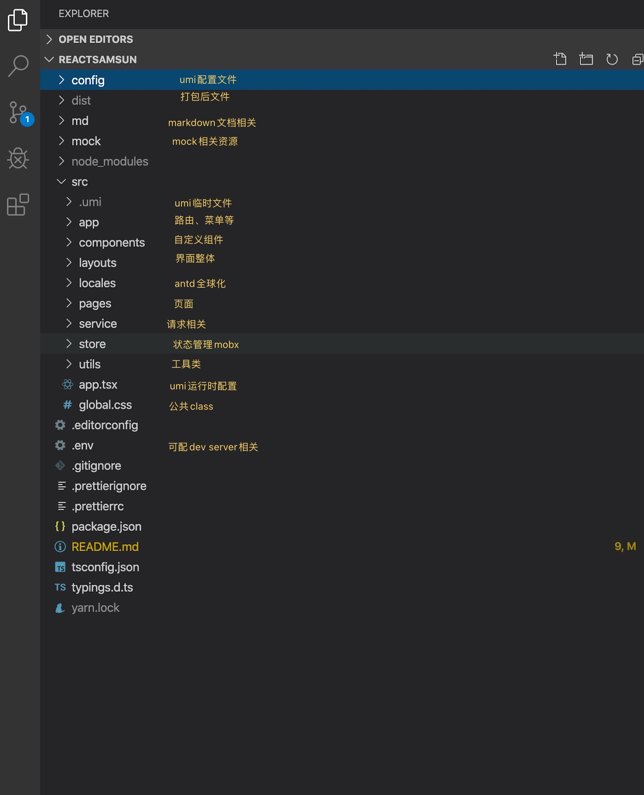

### 技术栈

- umi 脚手架
    - [文档](https://umijs.org/zh-CN/docs/navigate-between-pages)
- antd 4
- React 框架
- React Hook 推荐使用
    - [文档](https://react.docschina.org/docs/hooks-intro.html)
- mobx 状态管理
- typeScript
- axios request请求

### 开始使用

安装

```bash
$ yarn
```

启动

```bash
$ yarn start
```

打包

```bash
$ yarn build
```

本地测试打包后文件

```
<!-- 安装serve -->
$ yarn add -g serve

<!-- 检测某个文件夹 -->
$ server ./dist
```

多环境启动，可在package.json 自行添加

```
<!-- dev -->
$ yarn start:dev

<!-- sit -->
$ yarn start:sit

<!-- uat -->
$ yarn start:uat
```

获取多环境参数

``` tsx
const { REACT_APP_ENV } = process.env;
```

### 目录介绍



### 组件

- FormSam
    - form 表单
    - antd Form 二次封装
    - 使用参考 pages/searchPage

``` jsx

/* 入参 */
export interface FormSamProps {
    // initialValues: any /* 初始化对象 */;
    datas: FormDatasProps[] /* 需要渲染的组件对象 */;
    getForm?: Function /* 返回当前form对象进行绑定，可不传 */;
    fold?: boolean /* 是否显示折叠 */;
    columnNum?: any /* 列数 默认3列 */;
    antdProps?: any /* antd 其他参数可自己传入 */;
    [key: string]: any /* 其他 */;
}

export interface FormDatasProps {
    name: any /* 跟后台数据绑定的key */;
    label?: any /* 用户看到的title */;
    component: any /* 组件 */;
    rules?: any /* 校验 */;
    linkage?: Function /* 级联下拉关联父节点*/;
}

/*  
    对form 表单进行封装; 
    demo 参考 pages/searchPage; 
    支持下拉级联
*/
const FormSam: React.FC<FormSamProps> = props => {
    /* ... */
}
```


- SelectSam
    - antd Select 二次封装，带级联功能
    - 级联依赖 FormSam 组件, agTable里边级联不需要，参考 pages/searchPageAG

``` jsx
/* 
    入参
*/
/* 
    dataSource 可使用数组 OptionDatas[]
               可使用方法，返回promise
*/
export interface SelectProps {
    [key: string]: any;
    dataSource:
        | any
        | Function /* 可使用数组或一个返回promise的函数 ， 参考 pages/searchPageAG*/;
    linkage?: any /* 级联重新生成元素,参考 pages/searchPageAG  */;
    antdProps?: any /* antd 其他参数可自己传入 */;
}

export interface OptionDatas {
    text: string /* 用户看到 */;
    value: string /* 后端交互内容 */;
    selected: boolean /* 是否选中 */;
}

/* 下拉，支持级联下拉->需要在FormSam 组件中使用才兼容 */
const SelectSam: React.FC<SelectProps> = props => {
    /* ... */
}
```

- agGridTable
    - 联想agGridTable 封装
    - demo 参考 pages/searchPageAG 

``` jsx
/* 入参 */
interface GrideProps {
    store: TablePage /* table store */;
    usePage?: boolean /* 分页， 默认true */;
    disabled?: boolean /* 禁用， 默认false */;
    checkboxSelection?: boolean /* 复选框, 默认true */;
    key?: string /* key */;
    tableName?: string /* table 名称 */;
    actionObj?: any;
}


/* table 上边各摁扭事件 */
const actionObj = {
    add: async () => {
        // console.log("add")

        let columns = [...store.columns];
        let obj = {};

        columns.map(item => {
            obj[item.field] = '';
        });

        console.log('add', obj);
        store.onAddRow(obj);
    },
    save: async () => {
        console.log(toJS(store.changedTableList));
        store.saveTable();
    },
    remove: {
        delete: () => {
            store.onDelete(store.selectedRowData, null, {});
        },
        length: [...store.selectedRowData].length,
    },
    upload: {
        upload: () => {
            let obj = {
                data: {},
                action: store.getUploadUrl(),
            };
            // console.log(obj)
            return obj;
        },
        search: () => {/* 上传之后调用，可不传 */
            store.onSearch(store.filterParams);
        },
    },
    download: () => {
        const data = toJS(store.filterParams);
        store.onExport(data);
    },
    downloadTemplate: () => {
        const data = toJS(store.filterParams);
        store.downloadTemplate(data);
    },
};

/* 使用组件 */
<AgGridTable store={store} actionObj={actionObj} />

/* 分页数据规范 */
// 请求参数
{
	"filter":{ // 搜索条件
		"[key]":"[value]"
	},
	"pagination":{
		"order":"desc,asc",  //排序方式
		"field":"name,age",  //排序字段
		"current":1, //当前页码
		"pageSize":10, //每页条数
	}
}
// 返回格式
{
  "code":200,
  "msg":"msg",
  "data":{
        "total":99, // 数据总数
        "pageSize":10, // 每页条数
        "current":1, //当前页码
        "dataSource":[] // 数据数组
    }
}


```